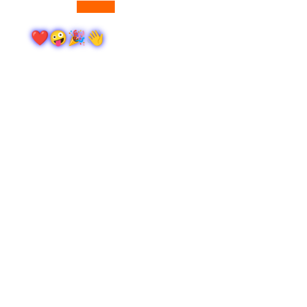

# Rabbitstream V2 Reverse Engineering

the js injects a [wasm bindgen](https://github.com/rustwasm/wasm-bindgen) binary (disguised as a png image, https://rabbitstream.net/images/loading.png?v=0.4) into the page which then attaches the following functions to the window object after calling the `greet` method:

- `window.jwt_plugin`
- `window.clipboard` (available after calling `window.jwt_plugin()`)

the resulting `ArrayBuffer` from `window.clipboard()` is converted into a `Uint8Array` (only if `window.t === window.localStorage.getItem('ktime')`) and then used for obtaining the sources decryption key.

the wasm binary is getting these values from the `window` object:

- `window.navigator.webdriver` (for automated browser detection by the binary, very easy to spoof to `false`)
- `window.navigator.userAgent`
- `window.location.origin`
- `window.xrax` (contains the rabbitstream embed id, i.e. `rhmlrjJvuI0b` in `https://rabbitstream.net/v2/embed-4/rhmlrjJvuI0b`)

after getting the above values (`window.navigator.webdriver` must be `false` for this to work), the wasm binary is then setting these keys in `window.localStorage`:

- `kversion` (e.g. `50906`)
- `kid` (e.g. `73c95d39a811e52a92410e73d79d1b6b6839ceca`)
- `ktime` (e.g. `1711250891917.4`)

then the https://rabbitstream.net/ajax/v2/embed-4/getSources endpoint is called with the following query string parameters:

```js
{
  id: rabbitstreamSourceId, // nothing new here since v1
  v: window.localStorage?.getItem('kversion') || window.browser_version,
  h: window.localStorage?.getItem('kid') || '',
  b: window.browser_version
}
```

that returns a response in the format:

```js
{
    "sources": "U2FsdGVkX1/ckzvoHOqrcEhCHq4lGpu9CTjKyuHS7jd6vX/W80kUA+zyVwMRjLbdJlMW9BfnQGYoXX8P0HZ6/8Ei6QteIm+Y21/ELxdwHFA/c6RbwfBRB/XXJsx8dslJ0Wihmwv+A2uJM1SGaqqqmvzFYJnMjrzeF72yRpOa2DT2fv8dG1vBpMLhmYwpA8S2fSKBSr5v7TqMhm2mqzawM1iC0hWvR3VPx2xd15dmas6f98dfJ4LWrCRPUaOr9UmX5I6tYSsOqlDFmDMFesgoRomWyPtWZ7dg7QNQ/8lD50KpnelTPuQYYPKnMfddyGXHwkvgUGC4c+Vt9oZZqRahGjfV086v/KNAqZzr6O0WS600wT0k07qY99g0opzFI5rlfOL7ey1ajABF33wkqIzqLZYQZSEgPrPr/hKISXHFHZSSbwNp3uShLvYfwBi6zc3BAeHZ0X9ZJ0RchEpmf9Vas1ycl5Zp4TXOcIP+b8TwR7hnvo6/DXzN+WwbnXMbJZe1", // encrypted sources array
    "tracks": [
        {
            "file": "https://cc.2cdns.com/12/47/12476dabd159d90720bf3db282c9f744/12476dabd159d90720bf3db282c9f744.vtt",
            "label": "English",
            "kind": "captions",
            "default": true
        }
    ],
    "t": 1,
    "server": 29
}
```

after a successful response, the following is run:

```js
const getOctets = (value) => {
  return [
    (0xff000000 & value) >> 24,
    (0x00ff0000 & value) >> 16,
    (0x0000ff00 & value) >> 8,
    0x000000ff & value,
  ];
};
const versionOctets = getOctets(
  window.localStorage?.getItem("kversion") || window.browser_version,
);

const xorKeyWithVersionOctets = (key) => {
  try {
    for (let i = 0; i < key.length; i++) {
      key[i] = key[i] ^ versionOctets[i % versionOctets.length];
    }
  } catch (e) {
    return null;
  }
};

const result = {
  sources: [],
  tracks: [],
};

if (Array.isArray(response.sources)) {
  result.sources = response.sources;
} else {
  let xoredKey;

  if (response.t != 0) {
    // i.e. response.t == 1
    xoredKey = xorKeyWithVersionOctets(new Uint8Array(window.clipboard()));
  } else {
    xoredKey = xorKeyWithVersionOctets(response.k);
  }

  const finalKey = btoa(
    String.fromCharCode.apply(null, new Uint8Array(xoredKey)),
  );

  try {
    const decryptResult = CryptoJS.AES.decrypt(response.sources, finalKey);
    return JSON.parse(decryptResult.toString(CryptoJS.enc.Utf8));
  } catch (e) {
    console.log(e.message);
  }
}

return result;
```

where result will contain the decrypted sources as before.

### `window.browser_version`

this appears to be a fingerprint calculated from `navigator.userAgent` and some feature checks (the following code was deobfuscated by chatgpt):

```js
function getBrowserInfo() {
  try {
    navigator.appVersion;
    var userAgent = navigator.userAgent;
    var appName = navigator.appName;
    var versionString = "" + parseFloat(navigator.appVersion);
    var versionInt = parseInt(navigator.appVersion, 10);

    if (-1 != (index = userAgent.indexOf("Opera"))) {
      appName = "Opera";
      versionString = userAgent.substring(index + 6);
      if (-1 != (index = userAgent.indexOf("Version"))) {
        versionString = userAgent.substring(index + 8);
      }
    } else if (-1 != (index = userAgent.indexOf("MSIE"))) {
      appName = "Microsoft Internet Explorer";
      versionString = userAgent.substring(index + 5);
    } else if (-1 != (index = userAgent.indexOf("Chrome"))) {
      appName = "Chrome";
      versionString = userAgent.substring(index + 7);
    } else if (-1 != (index = userAgent.indexOf("Safari"))) {
      appName = "Safari";
      versionString = userAgent.substring(index + 7);
      if (-1 != (index = userAgent.indexOf("Version"))) {
        versionString = userAgent.substring(index + 8);
      }
    } else if (-1 != (index = userAgent.indexOf("Firefox"))) {
      appName = "Firefox";
      versionString = userAgent.substring(index + 8);
    } else {
      var spaceIndex = userAgent.lastIndexOf(" ") + 1;
      var slashIndex = userAgent.lastIndexOf("/");
      if (spaceIndex < slashIndex) {
        appName = userAgent.substring(spaceIndex, slashIndex);
        versionString = userAgent.substring(slashIndex + 1);
        if (appName.toLowerCase() == appName.toUpperCase()) {
          appName = navigator.appName;
        }
      }
      if (-1 != (semicolonIndex = versionString.indexOf(";"))) {
        versionString = versionString.substring(0, semicolonIndex);
      }
    }

    versionInt = parseInt("" + versionString, 10);
    if (isNaN(versionInt)) {
      versionString = "" + parseFloat(navigator.appVersion);
      versionInt = parseInt(navigator.appVersion, 10);
    }

    return {
      browserName: appName,
      fullVersion: +versionString.split(".")[0],
      majorVersion: versionInt,
    };
  } catch (error) {
    return {
      browserName: "",
      fullVersion: "",
      majorVersion: "",
    };
  }
}

var browserInfo = getBrowserInfo();

// Function to check if CanvasRenderingContext2D is supported
var canvasSupported = document && document.createElement("canvas");
var canvasContextSupported =
  canvasSupported && null != canvasSupported.getContext;

// Function to check if WebGL is supported
var webGLSupported =
  canvasSupported &&
  canvasSupported.getContext &&
  null != canvasSupported.getContext("webgl");

// Function to check various other features
var browserFeatures = [
  // Checks for the existence of specific features
  null !=
    (document &&
      document.getElementById &&
      document.getElementById("9cbc1d63ef40c79")), // Check if specific element can be found in the DOM
  canvasContextSupported, // Check if CanvasRenderingContext2D is supported
  null != window.WebSocket, // Check if WebSocket is supported
  null != document && null != document["$cdc_asdjflasutopfhvcZLmcfl_"], // Check if specific document property exists
  null != window.GPU, // Check if GPU is supported
  null != window.webkitMediaStream, // Check if MediaStream is supported
  null != window.RTCPeerConnection, // Check if RTCPeerConnection is supported
  null != window.RTCDataChannel, // Check if RTCDataChannel is supported
  webGLSupported, // Check if WebGL is supported
  null != window.WebGLActiveInfo, // Check if WebGLActiveInfo is supported
  null != window.WebAssembly, // Check if WebAssembly is supported
  window.WebAssembly && null != WebAssembly.instantiate, // Check if WebAssembly can be instantiated
  window.WebAssembly && null != WebAssembly.Module, // Check if WebAssembly Module is supported
  null != window.mdn, // Check if mdn is supported
  null != window.chrome, // Check if Chrome is supported
  null != window.documentPictureInPicture, // Check if Picture-in-Picture is supported
  window.WebAssembly && null != WebAssembly.Module, // Check if WebAssembly Module is supported again (duplicate)
  window.Audio, // Check if Audio is supported
  null != CanvasGradient, // Check if CanvasGradient is supported
  null != window.document, // Check if document object is supported
  null != window.navigator, // Check if navigator object is supported
  window.navigator && null != window.navigator.userAgentData, // Check if navigator.userAgentData is supported
  window.navigator &&
    window.navigator.userAgentData &&
    1 == window.navigator.userAgentData.mobile, // Check if user is on a mobile device
  window.navigator &&
    window.navigator &&
    "Mozilla" == window.navigator.appCodeName, // Check if navigator.appCodeName is 'Mozilla'
  browserInfo && browserInfo.fullVersion && browserInfo.fullVersion < 100, // Check if fullVersion property is less than 100
];

// Convert the array of feature checks to a binary string
var binaryString = browserFeatures
  .map((feature) => (feature ? "1" : "0"))
  .join("");

// Function to convert binary string to an integer representing the browser version
window.browser_version = (function (binaryString) {
  var chunks = binaryString.match(/.{1,8}/g);
  var integers = [];
  for (var i = 0; i < chunks.length; i++) {
    integers.push(+parseInt(chunks[i], 2).toString(10));
  }
  return (
    (integers[0] << 24) | (integers[1] << 16) | (integers[2] << 8) | integers[3]
  );
})(binaryString);
```

chrome v123 on linux:

```js
const browserInfo = {
  browserName: "Chrome",
  fullVersion: 123,
  majorVersion: 123,
};
const binaryString = "011011111111011111111010";
window.browser_version = 1878522368;
```

### what is the wasm binary doing?

the wasm binary appears to be creating a fingerprint using [this image](https://rabbitstream.net/images/image.png?v=0.1.4) by drawing it into a canvas and calling `getImageData` on it.

additionally it renders a canvas and runs `toDataURL` which produces this:


so it looks like it's using some code from https://github.com/drbh/wasm-fingerprint for extra fingerprinting, given away by [this line here](https://github.com/drbh/wasm-fingerprint/blob/e30e7582fda6c5cfdb165a22e9e3c4f668ca3ff9/src/lib.rs#L43) which is rendering the same emojis.

it appears to be using the first fingerprint, second fingerprint and the embed id in some way to generate the `kid` + `kversion` values which are then used in the `getSources` request as described above.

`window.clipboard` is reset to `undefined` after a 10 second timeout.
